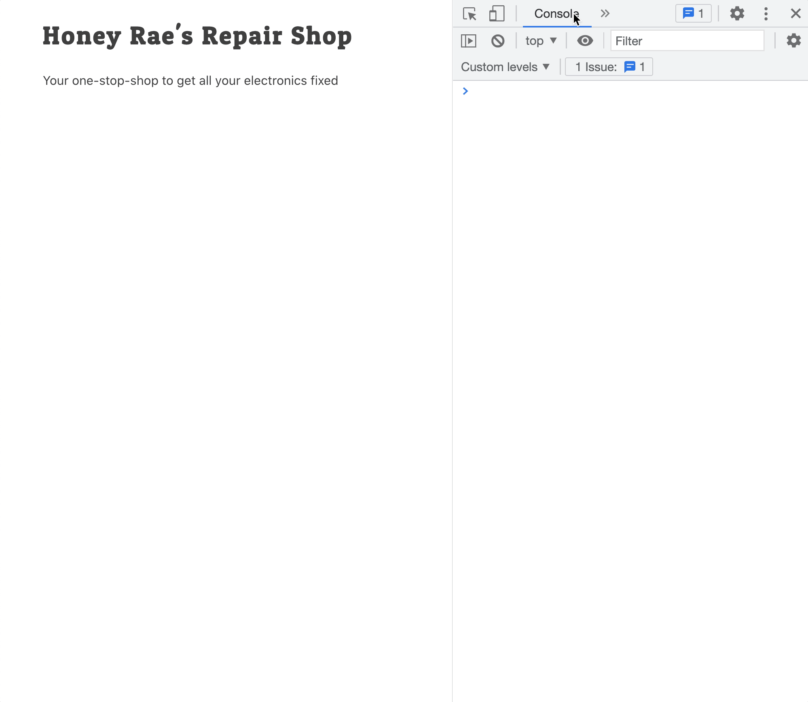

# Getting Started with React

React is a library that was open sourced by the development team at Facebook with the sole purpose of managing how data is displayed to the user. It doesn't care about the database, it doesn't care how data is retrieved, and it doesn't care about how complex the rest of the application is.

You've already learned the vast majority of what React does for you when building the UI for your application.

1. Building components and child components
1. Modular code with JavaScript modules
1. Updating the DOM with document elements or string templates
1. Setting the state of a component

## Installing React Developer Tools

You can install the React Developer Tools via the [Chrome Store](https://chrome.google.com/webstore/detail/react-developer-tools/fmkadmapgofadopljbjfkapdkoienihi).
You will get two new tabs in your Chrome DevTools:

* ⚛️ Components
* ⚛️ Profiler

These tools will help you debug and inspect your React applications.

## React Developer Tools

Watch the Intro to React Dev Tools video below to review their usage. Again, just like with VanillaJS, your use of the React dev tools is the only other way than using the debugger to gather evidence.

[](https://www.youtube.com/watch?v=rb1GWqCJid4)

## Creating the Application

```sh
cd ~/workspace
npx create-react-app honey-rae-repairs
```

Once installation is complete, run these commands

```sh
cd honey-rae-repairs/src
rm App*
```

## Getting Organized

Before we grow this application, let's create a meaningful directory structure.

1. Inside your `src` directory, `mkdir` a `components` sub-directory.
2. `cd` into the `components` directory.
3. `touch` `Repairs.js` and `Repairs.css`.
4. Within components, `mkdir` an `customers` directory
5. `cd` into the `customers` directory.
6. `touch CustomerList.js Customers.css`

```
- src
    - components
        - customers
            - CustomerList.js
            - Customers.css
        - Repairs.js
        - Repairs.css
  index.js
```

## Default Styling

Add the following code to `Repairs.css`.

```css
/* Import the google web fonts you want to use */
@import url("https://fonts.googleapis.com/css?family=Comfortaa|Patua+One");

/*Typography
--------------------------------------------------------------*/
body,
button,
input,
select,
textarea {
  color: #404040;
  font-family: "Comfortaa", Arial, sans-serif;
  font-size: 14px;
  line-height: 1.5;
}

body {
    padding: 0 3rem;
}

h1, h2, h3, h4, h5, h6 {
  font-family: "Patua One", serif;
  letter-spacing: 2px;
}

p {
  margin-bottom: 1.5em;
}
```

## Starter Code

### Repairs Module

Copy pasta the following code into the specified module to create a React component named **`Repairs`**.

  > #### `src/components/Repairs.js`

```js
import "./Repairs.css"

export const Repairs = () => {
    return <>
      <h1>Honey Rae's Repair Shop</h1>

      <p>Your one-stop-shop to get all your electronics fixed</p>
    </>
}
```

### Index Module

The following `index.js` module can be copy pasta directly into the existing file and then closed. You won't need to make any changes to it.

> #### `src/index.js`

```js
import { Repairs } from "./components/Repairs"
import { createRoot } from 'react-dom/client'
import './index.css'

const container = document.getElementById('root')
const root = createRoot(container)
root.render(
    <Repairs /> //  <---- This is where the Repairs component is rendered
)

```

## Starting Your React Application

In your terminal, make sure you are in the top-level project directory, and not in the `public` or `src` sub-directory, and type the following command.

```sh
npm start
```

Your default browser will immediately start a new tab and the application will automatically load. You should see the title of the application and tagline appear. You can also open your **Components** dev tools panel and inspect the **`Repairs`** component.



## Next Steps

Now that you have a bare-bones React application running, it's time to define and explore the data that you will be using for this application and how it's all related to each other.

Navigate to the [Honey Rae's API](./chapters/REPAIR_API.md) chapter to continue...
