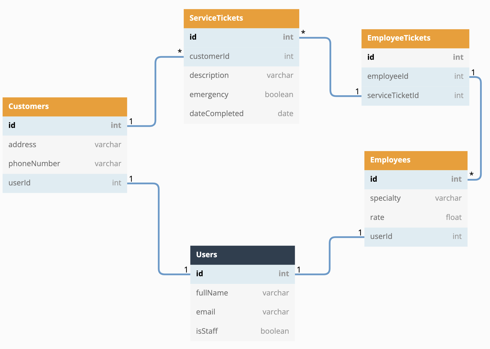

# Honey Rae's API

## ERD

Go to [dbdiagram](https://dbdiagram.io/d/), create a new diagram, and then copy pasta the DBML below into the definition panel. The visual ERD should appear as soon as the text is pasted.



<details>
    <summary>Expand to get the DBML for Honey Rae's</summary>

```sql
Table Users [headercolor: #2c3e50] {
  id int pk
  fullName varchar
  email varchar
  isStaff boolean
}

Table Customers [headercolor: #f39c12] {
  id int pk
  address varchar
  phoneNumber varchar
  userId int [ref: - Users.id]
}

Table Employees [headercolor: #f39c12] {
  id int pk
  specialty varchar
  rate float
  userId int [ref: - Users.id]
}

Table ServiceTickets [headercolor: #f39c12] {
  id int pk
  customerId int [ref: > Customers.id]
  description varchar
  emergency boolean
  dateCompleted date
}

Table EmployeeTickets [headercolor: #f39c12] {
  id int pk
  employeeId int [ref: < Employees.id]
  serviceTicketId int [ref: < ServiceTickets.id]
}
```

</details>

### Relationships Explanation

* There are two kinds of users in this application - employees and customers - but both are **Users**.
* **Customers**, who are **Users**, have two additional properties of `address` and `phoneNumber`.
* **Employees**, who are **Users**, have two additional properties of `specialty` and `rate`.
* When a new employee account is registered, two things must happen
    * A new object in the **Users** table must be created with the `isStaff` property set as `true`.
    * A new object in the **Employees** table must be created with a foreign key (`userId`) that stores the the value of the primary key of the user object created in the previous step. Tip: chained fetch calls will be needed.
* When a new customer account is registered, two things must happen
    * A new object in the **Users** table must be created with the `isStaff` property set as `false`.
    * A new object in the **Customers** table must be created with a foreign key (`userId`) that stores the value of the primary key of the user object created in the previous step. Again, chained fetch calls will be needed.
* Customers can create service tickets that go in the queue. No employee is assigned on creation. Employees assign someone at a future date.
* When an employee is assigned to a ticket, a new object in the **EmployeeTickets** table is created for that relationship.

## JSON Data

Before you start building your React application, you need a JSON file to store persistent data. Please follow these steps to get it set up.

```sh
cd ~/workspace
mkdir honey-raes-api
cd honey-raes-api
touch database.json
```

Then copy the following JSON into the `database.json` file.

<details>
    <summary>Expand to get the JSON data</summary>

```json
{
    "users": [
        {
            "id": 1,
            "name": "Dion Stoade",
            "email": "dstoade0@cornell.edu",
            "isStaff": false
        },
        {
            "id": 2,
            "name": "Windy Thorneloe",
            "email": "wthorneloe1@usa.gov",
            "isStaff": false
        },
        {
            "id": 3,
            "name": "Hillie Phillpotts",
            "email": "hphillpotts2@rakuten.co.jp",
            "isStaff": false
        },
        {
            "id": 4,
            "name": "Helenelizabeth Passfield",
            "email": "hpassfield7@netvibes.com",
            "isStaff": true
        },
        {
            "id": 5,
            "name": "Franchot Slator",
            "email": "fslator8@51.la",
            "isStaff": true
        },
        {
            "id": 6,
            "name": "Renaud Erbe",
            "email": "rerbe9@psu.edu",
            "isStaff": true
        }
    ],
    "customers": [
        {
            "id": 1,
            "address": "2802 Zula Locks",
            "phoneNumber": "852-837-9713",
            "userId": 2
        },
        {
            "id": 2,
            "address": "56849 Fadel Gateway",
            "phoneNumber": "202-244-7090",
            "userId": 1
        },
        {
            "id": 3,
            "address": "7346 Ritchie Road",
            "phoneNumber": "(507) 720-1157",
            "userId": 3
        }
    ],
    "employees": [
        {
            "id": 1,
            "specialty": "PC Repair",
            "rate": 72.47,
            "userId": 4
        },
        {
            "id": 2,
            "specialty": "Apple Repair",
            "rate": 97.39,
            "userId": 5
        },
        {
            "id": 3,
            "specialty": "Printer Repair",
            "rate": 29.45,
            "userId": 6
        }
    ],
    "serviceTickets": [
        {
            "id": 1,
            "customerId": 3,
            "description": "Saepe ex sapiente deserunt et voluptas fugiat vero quasi. Ipsam est non ipsa. Occaecati rerum ipsa consequuntur. Ratione commodi unde sint non rerum. Sit quia et aut sunt.",
            "emergency": false,
            "dateCompleted": "Fri Apr 29 2022 14:02:20 GMT-0500 (Central Daylight Time)"
        },
        {
            "id": 2,
            "customerId": 3,
            "description": "Vero est adipisci sed natus quasi consectetur occaecati. Modi maxime sunt officia cumque. Vel at culpa. Sint accusamus deserunt dolorem qui.",
            "emergency": false,
            "dateCompleted": ""
        },
        {
            "id": 3,
            "customerId": 1,
            "description": "Sunt pariatur et quidem hic voluptatem. Neque aliquam voluptas eos incidunt repellendus. Vero expedita non sit quaerat sit et eum. Quasi dolor voluptatem illum eum qui est expedita sequi accusamus.",
            "emergency": false,
            "dateCompleted": ""
        },
        {
            "id": 4,
            "customerId": 2,
            "description": "A deleniti est sed vel. Dolores aliquid enim vero. Quia eligendi vel voluptas. Nihil nihil quasi ullam officia doloremque amet non. Officia atque quae.",
            "emergency": false,
            "dateCompleted": ""
        },
        {
            "id": 5,
            "customerId": 1,
            "description": "Pariatur nihil animi eos doloremque laborum fugiat consequuntur iusto. Et tempore a enim.",
            "emergency": false,
            "dateCompleted": "Fri Apr 29 2022 21:24:29 GMT-0500 (Central Daylight Time)"
        }
    ],
    "employeeTickets": [
        {
            "id": 1,
            "employeeId": 3,
            "serviceTicketId": 1
        },
        {
            "id": 2,
            "employeeId": 2,
            "serviceTicketId": 5
        },
        {
            "id": 3,
            "employeeId": 1,
            "serviceTicketId": 4
        }
    ]
}
```
</details>

Every time you want to work on your application, you'll need to ensure that the API is running. Open a new terminal and start it.

```sh
json-server -p 8088 database.json
```

Feel free to make more of each resource if you want to see more data in your API.

| | |
|:---:|:---|
| <h1>&#x2757;</h1> |  _The [vscode-faker](https://marketplace.visualstudio.com/items?itemName=deerawan.vscode-faker) extension for Visual Studio Code is a fast, easy way to generate starter data._ |

## Backup to Github

Make sure you create a repository on your Github account for your API, and hook up the `honey-raes-api` directory. Yes, there's only one file being tracked in this repository, and that's ok.
